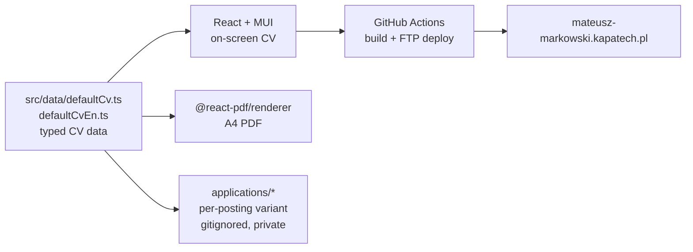

# cv-app

A CV maintained as code: one typed data source renders both the web page and a
downloadable PDF, and an agent produces per-posting variants from that same
source instead of hand-editing parallel documents.

## Why

Applying for roles means the CV has to change for each posting — different
emphasis, different keywords, different ordering. Doing that by hand produces a
drawer full of near-duplicate documents that drift apart: a fix made in one
version never reaches the others, and the "current" copy is whichever file was
opened last. Treating the CV as a single structured source removes the drift —
there is exactly one place where a fact lives, and every output is generated
from it.

## How it works

The content lives in typed data files, not in markup. Components read that data
to render the on-screen CV; the same data feeds a separate PDF document, so the
page and the PDF can never disagree. A posting-specific variant is a
reordering/re-emphasis of the same facts, produced by the agent into a private
working directory and deployed as needed.



- **Source** — `src/data/defaultCv.ts` (Polish) and `src/data/defaultCvEn.ts`
  (English), both typed by `src/types/cv.types.ts`.
- **Web** — `CvSidebar` and `CvMain` render the source with a PL/EN toggle.
- **PDF** — `usePdfExport` renders `CvPdfDocument` (`@react-pdf/renderer`) to an
  A4 blob and downloads it; layout is defined independently of the DOM, not
  screenshotted from it.
- **Variant** — a posting-specific version is generated into `applications/`,
  which is gitignored: variants and any posting details stay out of the public
  repo.
- **Deploy** — `.github/workflows/deploy.yml` builds on push to `main` and
  uploads `dist/` over FTPS to the custom domain.

## Agent workflow

The repository is set up to be edited by an agent (Claude Code), not only by a
human. Two files give the agent its context:

- `CLAUDE.md` — project map: stack, key files, architecture, commands.
- `AGENT.md` — a longer description of the data model, components and rendering
  flow for the agent to reason over.

Per-posting work follows a fixed convention: read the posting, map each thing it
asks for to a concrete fact already present in the source, and generate a
variant into `applications/`. The binding constraint is that **the agent may not
invent facts** — no technologies, employers, dates, certifications or metrics
that are not already in the source data. Where a posting asks for something the
candidate does not have, the agent records it as a gap in its report, never as
CV content. This keeps every generated document defensible against the source.

## Design decisions

- CV content is typed data, so the page and the PDF are two views of one source
  and cannot fall out of sync.
- The PDF is built with `@react-pdf/renderer` (a real document layout) rather
  than by screenshotting the DOM, which keeps text selectable and the output
  independent of the browser.
- Content is bilingual (PL/EN) from a single label map and two data files,
  toggled at runtime.
- Private material (posting variants, personal job-search data) is kept out of
  the repo by gitignore rather than living next to the public source.

## Getting started

```bash
npm install
npm run dev      # Vite dev server
npm run build    # tsc + Vite production build → dist/
npm run preview  # serve the production build locally
```

Editing the CV means editing the data in `src/data/`; there is no in-app editor
and no backend — the app is static.

## Tech stack

React 19 · TypeScript · Vite · MUI v9 · @react-pdf/renderer · GitHub Actions
